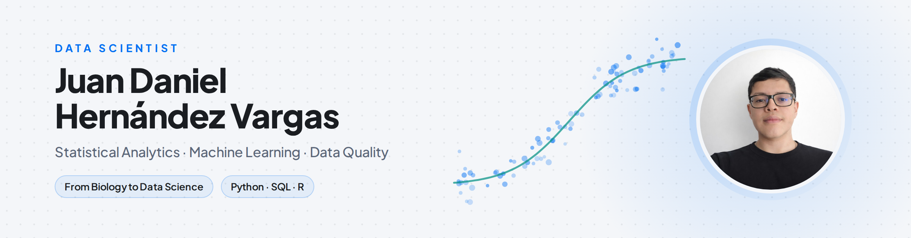

  <picture>
    <source media="(prefers-color-scheme: dark)" srcset="Images/banner_dark.png">
    
  </picture>

<h1 align="center">Hi, I'm Juan 👋</h1>

  
  &nbsp;
  
  &nbsp;
  

  

---

## 🧩 About Me

I'm a **Data Scientist** completing a professional specialization in **Statistical Analytics**. My background in **Biology** gave me a scientific way of working: frame the question well, check the evidence, and justify every decision.

I work with data from different domains — credit risk, fraud detection, customer retention, urban mobility and financial time series — with one common thread: understand the data before modeling it, choose methods that fit the problem, and deliver explainable results that people can act on.

- 🔬 Biology → Data Science, with an evidence-first approach to every analysis
- 🧹 Data quality first: validation rules, anomaly detection and imputation grounded in domain knowledge
- 📊 Explainable models with **SHAP** — results that show *why*, not just *what*
- 📦 Reproducible projects: `uv` environments, tests and documented decisions
- 🧬 Next step: bringing the same rigor to **biological databases**

---

## 🛠️ Tech Stack

**Languages & Core**

-336791?style=for-the-badge&logo=postgresql&logoColor=white)

**Data Science & ML**

**Statistics**

**BI & Visualization**

**Tools**

---

## 📂 Featured Projects

### 🛡️ [Transaction Fraud Detection — SQL, LightGBM & Autoencoder](https://github.com/Juanhv24/transaction-fraud-detection)
End-to-end project on **590,540** e-commerce transactions (IEEE-CIS): SQLite is the single source of data and builds each card's history with window functions, a LightGBM tuned with Optuna under chronological validation ranks the alerts and is explained with SHAP, and a PyTorch autoencoder tests how much fraud can be found without labels.

| Metric | Result |
|--------|--------|
| Test PR-AUC (last 41 days) | **0.50** (14.6× random) |
| Alerts that are fraud, riskiest 1% reviewed | **85.4%** |
| Fraud caught, riskiest 5% reviewed | **57.5%** |
| Label-free autoencoder PR-AUC | **0.067** |

`SQL (SQLite)` `Python` `LightGBM` `Optuna` `SHAP` `PyTorch` `uv` `pytest`

---

### 🚕 [NYC Taxi — Operations & Fare Integrity Dashboard](https://github.com/Juanhv24/nyc-taxi-ops-dashboard) · [Live dashboard](https://juanhv24.github.io/nyc-taxi-ops-dashboard/)
Interactive dashboard over **9.7 million** New York yellow-taxi trips: where and when demand concentrates, which fares are inconsistent with the official rate card, and how every data-quality issue was treated. Rate-card rules, a robust route-level check and a model-based imputation replace generic outlier thresholds.

| Metric | Result |
|--------|--------|
| Trips analyzed | **9.7M** |
| Valid analytical base | **99.6%** |
| Standard trips within the rate card | **99.99%** |
| Distance imputation error (MAE) | **0.19 mi** |

`Python` `Pandas` `PyArrow` `uv` `pytest` `ECharts` `GitHub Pages`

---

### 📈 [Colombian Exchange Rate (TRM) — Forecast with Risk Bands](https://github.com/Juanhv24/Time-Series-Colombia) · [Live dashboard](https://juanhv24.github.io/Time-Series-Colombia/)
Box-Jenkins study of nearly 35 years of Colombia's official COP/USD rate, from the daily series to an **ARIMA(0,1,1) + GARCH(1,1)** model for the monthly average. The dashboard turns 5,000 simulated scenarios into risk bands and into the probability that the rate exceeds a reference level: the point forecast does not beat a random walk, but the GARCH bands are well calibrated, which is what matters for budgeting.

| Metric | Result |
|--------|--------|
| Monthly observations | **416** (1991–2026) |
| Point forecast vs random walk | **No significant difference** (Diebold-Mariano p = 0.16) |
| Months outside the 95% band | **6.7%** (5% expected; 11.7% with constant variance) |
| Forecast horizon | **12 months** |

`Python` `Statsmodels` `arch` `uv` `pytest` `ECharts` `GitHub Pages`

---

### 🏦 [Credit Origination Model & Vendor Benchmarking](https://github.com/Juanhv24/credit-origination-model)
Full credit-scoring pipeline with out-of-time validation, SHAP audit and an ethical-AI analysis. Comparing Gender-inclusive vs Gender-blind models showed a **1.96 pp GINI** cost for a fairer system, and no external vendor outperformed the internal model.

| Metric | Result |
|--------|--------|
| AUC-ROC (OOT) | **0.627** |
| GINI | **25.3%** |
| Validation | **Out-of-time** |

`LightGBM` `Optuna` `SHAP` `Scikit-Learn` `SciPy`

---

## 🗂️ Other Projects

- ⚙️ **[Job Application Tracker — Chrome Extension & Serverless Backend](https://github.com/Juanhv24/job-tracker)** · One click logs a job posting into a Google Sheet: an Apps Script backend drafts the outreach message and a cover letter with Claude, and a scheduled Gmail job advances each application's stage. `JavaScript` `Chrome Extension (MV3)` `Google Apps Script` `Anthropic API`
- 🏦 **[Customer Churn Prediction — Beta Bank](https://github.com/Juanhv24/Beta-Bank)** · Churn classifier on an imbalanced dataset: a Random Forest with minority-class upsampling reached **F1 0.62** and **AUC-ROC 0.86** on the test set, above the 0.59 target. `Scikit-Learn` `Random Forest`

---

## 🚧 In Progress

- 🧬 **[Mice Protein Expression — Supervised Learning](https://github.com/Juanhv24/mice-supervisado)** · Course project on protein expression data from a mouse model of Down syndrome: EDA, regression and multiclass classification. `Scikit-Learn` `uv`

---

## 🔥 GitHub Stats

  
    
  
    
  

---

  <strong>Thanks for visiting ✨</strong> 
  Open to Data Science and Data Analytics roles. 
  <a href="https://juanhv24.github.io/en.html">→ See my full portfolio</a>

