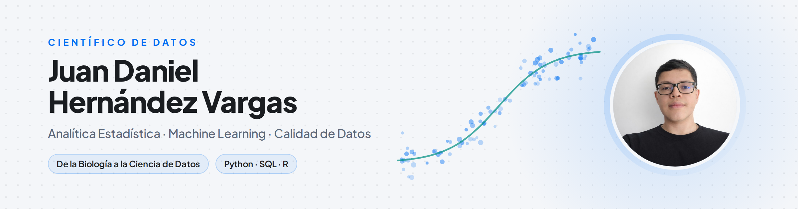

  <picture>
    <source media="(prefers-color-scheme: dark)" srcset="Images/banner_dark_es.png">
    
  </picture>

<h1 align="center">Hola, soy Juan Daniel Hernandez 👋</h1>

  
  &nbsp;
  
  &nbsp;
  

  

---

## 🧩 Sobre mí

Soy **Científico de Datos** en proceso de completar una especialización profesional en **Analítica Estadística**. Mi formación en **Biología** me dio una forma de trabajar basada en el método científico: plantear bien la pregunta, revisar la evidencia y justificar cada decisión.

Trabajo con datos de distintos dominios, como el riesgo crediticio, la retención de clientes, la movilidad urbana y las series de tiempo financieras, con un mismo hilo conductor: entender los datos antes de modelarlos, elegir métodos acordes al problema y entregar resultados explicables que se puedan convertir en decisiones.

- 🔬 De la Biología a la Ciencia de Datos, con un enfoque basado en la evidencia en cada análisis
- 🧹 La calidad de los datos primero: reglas de validación, detección de anomalías e imputación con criterio de dominio
- 📊 Modelos explicables con **SHAP**, que muestran el *por qué* y no solo el *qué*
- 📦 Proyectos reproducibles: entornos con `uv`, pruebas y decisiones documentadas
- 🧬 Próximo paso: llevar ese mismo rigor a las **bases de datos biológicas**

---

## 🛠️ Stack Tecnológico

**Lenguajes y Core**

-336791?style=for-the-badge&logo=postgresql&logoColor=white)

**Ciencia de Datos & ML**

**Estadística**

**BI & Visualización**

**Herramientas**

---

## 📂 Proyectos Destacados

### 🚕 [Taxis de NYC — Tablero de Operación e Integridad Tarifaria](https://github.com/Juanhv24/nyc-taxi-ops-dashboard) · [Ver tablero](https://juanhv24.github.io/nyc-taxi-ops-dashboard/)
Tablero interactivo sobre **9.7 millones** de viajes de taxis amarillos de Nueva York: dónde y cuándo se concentra la demanda, qué cobros no son consistentes con el tarifario oficial y qué tratamiento recibió cada problema de calidad de datos. Las reglas del tarifario, una regla robusta por ruta y una imputación basada en modelo reemplazan los umbrales genéricos de detección de atípicos.

| Métrica | Resultado |
|---------|-----------|
| Viajes analizados | **9.7M** |
| Base analítica válida | **99.6%** |
| Viajes estándar dentro del tarifario | **99.99%** |
| Error de imputación de distancia (MAE) | **0.19 mi** |

`Python` `Pandas` `PyArrow` `uv` `pytest` `ECharts` `GitHub Pages`

---

### 🏦 [Modelo de Originación Crediticia & Benchmarking de Proveedores](https://github.com/Juanhv24/credit-origination-model)
Pipeline completo de scoring crediticio con validación fuera de tiempo (OOT), auditoría SHAP y análisis de IA ética. La comparación de modelos con y sin la variable Género mostró un costo de **1.96 pp de GINI** a cambio de un sistema más justo, y ningún proveedor externo superó al modelo interno.

| Métrica | Resultado |
|---------|-----------|
| AUC-ROC (OOT) | **0.627** |
| GINI | **25.3%** |
| Validación | **Fuera de tiempo** |

`LightGBM` `Optuna` `SHAP` `Scikit-Learn` `SciPy`

---

### 🏦 [Predicción de Churn & IA Explicable — Beta Bank](https://github.com/Juanhv24/Beta-Bank)
Predicción de qué clientes bancarios tienen mayor probabilidad de abandonar el banco, usando **Random Forest + SMOTE** sobre un dataset desbalanceado. El análisis SHAP identifica los factores clave: edad, estado de actividad y geografía.

| Métrica | Resultado |
|---------|-----------|
| F1 Score | **0.62** |
| AUC-ROC | **0.86** |
| Modelos evaluados | 3 |

`Python` `Scikit-Learn` `Random Forest` `SHAP` `SMOTE` `Imbalanced-learn`

---

### ⚙️ [Seguimiento de Postulaciones — Extensión de Chrome & Backend Serverless](https://github.com/Juanhv24/job-tracker)
Un clic registra una vacante en una Google Sheet: una extensión de Chrome extrae la oferta, un backend en Apps Script redacta el mensaje de contacto y una carta de presentación en PDF con Claude, y una rutina programada sobre Gmail avanza sola la etapa de cada postulación. Ninguna API key viaja dentro de la extensión: todas las credenciales viven en el servidor.

`JavaScript` `Extensión Chrome (MV3)` `Google Apps Script` `Anthropic API` `Gmail API`

---

## 🚧 En Desarrollo

- 📈 **[Tasa de Cambio (TRM) de Colombia — Series de Tiempo](https://github.com/Juanhv24/Time-Series-Colombia)** · Análisis Box-Jenkins de la TRM entre 1991 y 2026. El log-retorno diario se comporta como ruido blanco, mientras que el promedio mensual muestra una estructura MA(1) que se explica por la forma en que se promedia el indicador y no por una capacidad de predicción. `Statsmodels` `ARIMA/SARIMA` `uv`
- 🧬 **[Expresión de Proteínas en Ratones — Aprendizaje Supervisado](https://github.com/Juanhv24/mice-supervisado)** · Proyecto de curso con datos de expresión de proteínas en un modelo murino de síndrome de Down: EDA, regresión y clasificación multiclase. `Scikit-Learn` `uv`
- 🇨🇴 **Serie con datos abiertos de Colombia** · EDA de siniestros del SOAT, análisis de brechas de inclusión financiera y acceso a crédito de micronegocios con la encuesta del DANE.

---

## 🔥 Estadísticas de GitHub

  
    
  
    
  

---

  <strong>Gracias por visitar mi perfil ✨</strong> 
  Abierto a roles en Ciencia de Datos y Analítica de Datos. 
  <a href="https://juanhv24.github.io/es.html">→ Ver mi portafolio completo</a>

